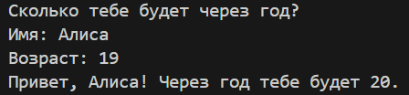

# Лабораторная работа №1
### Задание 1
Код первого задания считает, сколько лет будет пользователю через год.
* Входные данные: имя, возраст.
* Вывод: приветствие и результат подсчета.

### Задание 2
Программа получает 2 числа и с помощью функций считает сумму и среднее арифметическое.
* Входные данные: числа а и б (вещественные), допускаются точка или запятая.
* Вывод: результаты вычислений с 2мя знаками после запятой.

### Задание 3
Программа с помощью функций считает НДС и сумму покупки как касса.
* Входные данные: цена (₽), скидка (%), НДС (%) — вещественные.
* Вывод: результаты вычислений в столбик с 2мя знаками после запятой.

### Задание 4
Программа переводит минуты в формат ЧЧ:ММ
* Входные данные: m — целые минуты.
* Вывод: ЧЧ:ММ

### Задание 5
Программа выводит инициалы из ФИО пользователя
* Входные данные: ФИО одной строкой (могут быть лишние пробелы).
* Вывод: инициалы (верхний регистр) и длина исходной строки без крайних пробелов.

