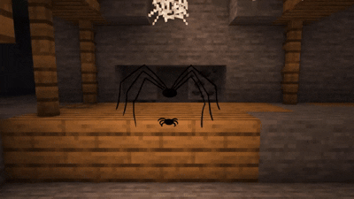

# ЛР-3 — Наследование и иерархия классов

## Цель
Изучить наследование, переопределение методов и полиморфизм.

## Предметная область
Недвижимость

## Объект
Property — объект недвижимости.

Более детально: [LAB01](/Year1_Sem2/labs/lab01)

## Коллекция
District — контейнер объектов Property.

Более детально: [LAB02](/Year1_Sem2/labs/lab02)

## Дочерние классы

### RentalProperty

Недвижимость для аренды.

Добавлено:

* арендатор

Методы:

* rent_to()
* close_contract()
* переопределён is_available()

### MortgageProperty

Недвижимость с ипотекой.

Добавлено:

* процентная ставка

Методы:

* monthly_payment()
* переопределён is_available()

## Реализовано

* наследование
* инкапсуляция
* переопределение методов
* полиморфизм

## Сценарии
1. Аренда

2. Ипотека

3. Полиморфизм

# Когда забыл про наследование в ООП

  

# Повторвите позу?

  

