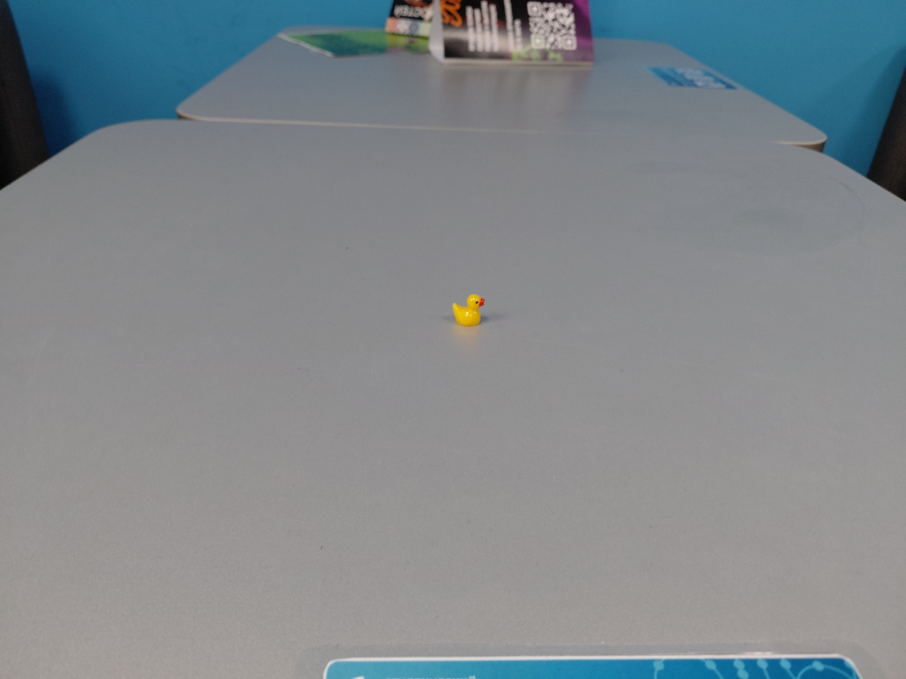
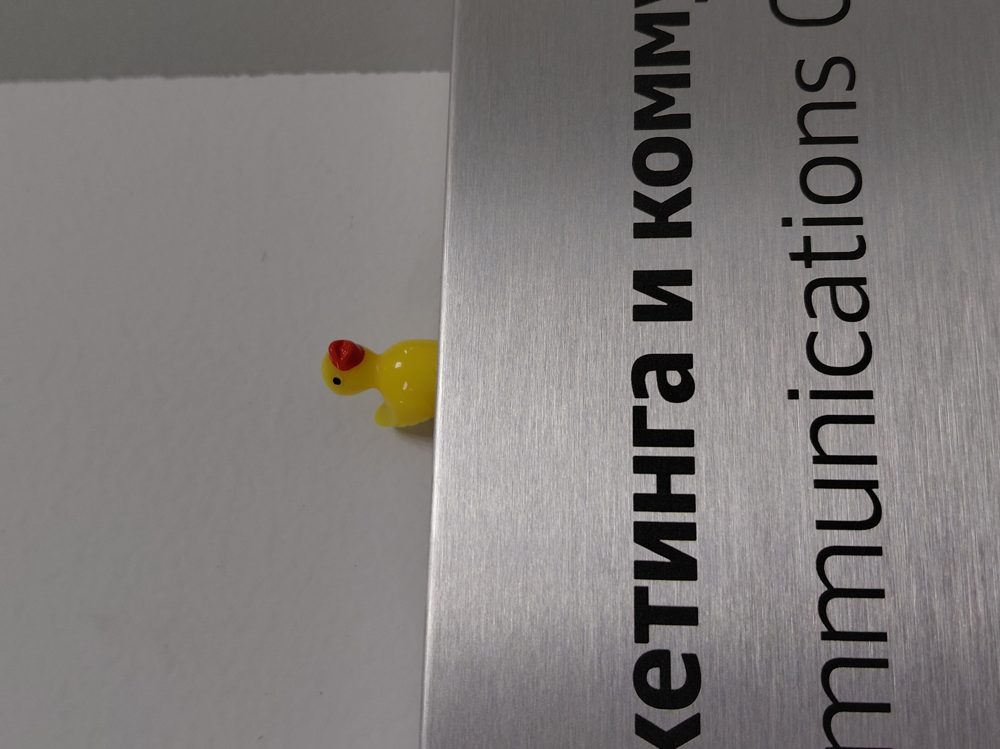
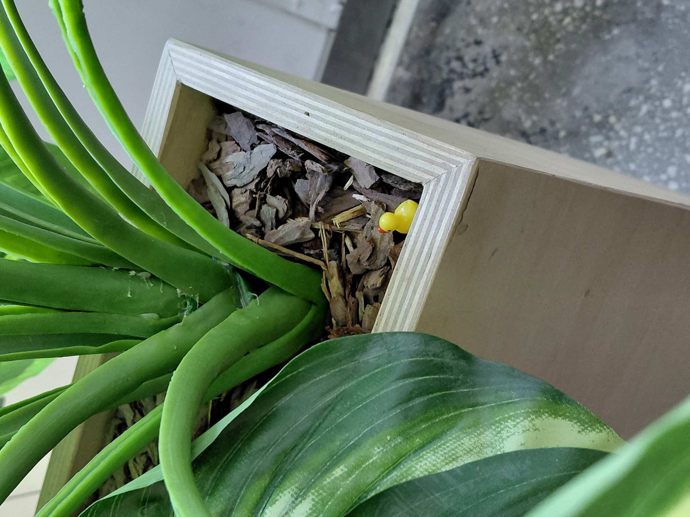

# ЛР-6 — Generics и typing

## Предметная область
Недвижимость

## Объекты
Система управления недвижимостью:
- объекты аренды 
- объекты с ипотекой 

## Реализованные типы и контейнеры

### Аннотации типов
Добавлены аннотации ко всем параметрам, возвращаемым значениям и атрибутам классов предметной области:
- Property, RentalProperty, MortgageProperty
- Все функции валидации в validate.py

### Обобщённый контейнер TypedCollection[T]
Generic-класс с параметром T. Предоставляет:
- add(item: T) — добавить элемент
- remove(item: T) — удалить элемент
- get_all() -> list[T] — получить копию списка элементов
- find(predicate: Callable[[T], bool]) -> Optional[T] — найти первый подходящий или None
- filter(predicate: Callable[[T], bool]) -> list[T] — отфильтровать элементы
- map(transform: Callable[[T], R]) -> list[R] — преобразовать элементы (второй TypeVar R позволяет изменить тип)

### Протоколы (Protocol)
Определены два структурных интерфейса:
- Displayable — требует метод display() -> str
- Scorable — требует метод score() -> float

Это позволяет создавать коллекции TypedCollection[D] и TypedCollection[S]`, гарантируя наличие методов display() или score() у элементов.

## demo.ru

### Сценарий 1 — Базовая работа TypedCollection и find, filter, 

### Сценарий 2 — Протокол Displayable

### Сценарий 3 — Протокол Scorable

# duck (typing) at MISIS

  

  

### Even he touches grass

  

